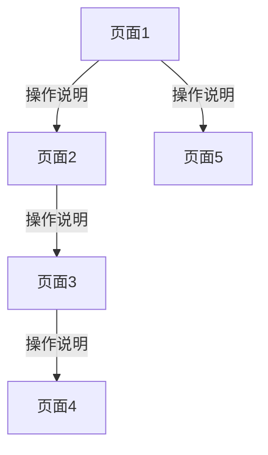

# [产品名称] 页面结构与导航流程

## 文档信息

| 字段 | 内容 |
|---|---|
| 产品名称 | [产品名称] |
| 文档版本 | v1.0 |
| 创建日期 | [YYYY-MM-DD] |
| 状态 | 已确认 |

---

## 1. 页面清单

| 页面编号 | 页面名称 | 页面类型 | 所属模块 | 核心职责 |
|---|---|---|---|---|
| P01 | [页面名称] | [主页面/详情页/弹窗/表单页] | [模块名] | [核心职责] |
| P02 | [页面名称] | [页面类型] | [模块名] | [核心职责] |
| P03 | [页面名称] | [页面类型] | [模块名] | [核心职责] |

---

## 2. 导航流程图

---

## 3. 页面说明

### P01 [页面名称]

- **入口**：[从哪里进入这个页面]
- **核心内容**：[页面展示什么]
- **主要操作**：[用户可以做什么]
- **出口**：[可以跳转到哪里]

### P02 [页面名称]

- **入口**：[从哪里进入这个页面]
- **核心内容**：[页面展示什么]
- **主要操作**：[用户可以做什么]
- **出口**：[可以跳转到哪里]

---

## 4. 关键入口与出口

### 4.1 产品入口

| 入口方式 | 目标页面 | 说明 |
|---|---|---|
| [入口方式，如：Tab栏] | [页面编号] | [说明] |
| [入口方式，如：推送通知] | [页面编号] | [说明] |

### 4.2 核心流程出口

| 流程终点 | 完成后去向 | 说明 |
|---|---|---|
| [流程名] | [页面编号/外部] | [说明] |
