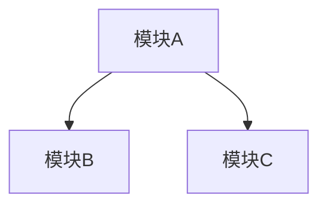
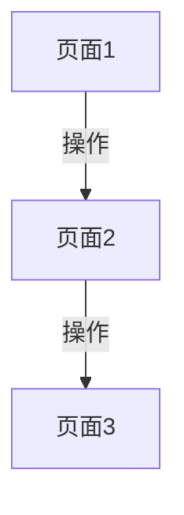

# [产品名称] 产品需求文档（PRD）

## 文档信息

| 字段 | 内容 |
|---|---|
| 产品名称 | [产品名称] |
| 文档版本 | v1.0 |
| 创建日期 | [YYYY-MM-DD] |
| 作者 | [作者] |
| 状态 | 已确认 |

---

## 1. 产品概述

### 1.1 产品背景

[为什么要做这个产品，解决什么问题。来源：需求逻辑定义.md]

### 1.2 目标用户

[产品的目标用户群体描述]

### 1.3 产品目标

[MVP阶段要达成的目标]

### 1.4 核心价值

[产品为用户提供的核心价值主张]

---

## 2. MVP需求范围

### 2.1 纳入MVP的功能

| 编号 | 功能点 | 优先级 | 纳入理由 |
|---|---|---|---|
| F01 | [功能名称] | P0 | [纳入理由] |
| F02 | [功能名称] | P0 | [纳入理由] |
| F03 | [功能名称] | P1 | [纳入理由] |

### 2.2 暂不纳入MVP的功能

| 编号 | 功能点 | 暂缓原因 |
|---|---|---|
| F10 | [功能名称] | [暂缓原因] |

### 2.3 范围边界

- **范围内**：[MVP范围内包含的内容]
- **范围外**：[MVP范围外不包含的内容]

---

## 3. 功能需求

### 3.1 [模块A名称]

#### 模块目标

[一句话说明这个模块要解决什么问题]

#### 核心功能点

| 编号 | 功能点 | 优先级 | 说明 |
|---|---|---|---|
| M01-F01 | [功能名称] | P0 | [功能说明] |

#### 交互逻辑

```
用户操作流程：
1. [步骤1]
2. [步骤2]
3. [步骤3]
```

#### 后端逻辑

**数据流转**：


**业务规则**：

| 规则编号 | 规则描述 | 适用条件 |
|---|---|---|
| R01 | [规则内容] | [适用条件] |

#### 边界条件与异常处理

| 场景 | 处理方式 |
|---|---|
| [异常场景] | [处理方式] |

---

### 3.2 [模块B名称]

#### 模块目标

[一句话说明这个模块要解决什么问题]

#### 核心功能点

| 编号 | 功能点 | 优先级 | 说明 |
|---|---|---|---|
| M02-F01 | [功能名称] | P0 | [功能说明] |

#### 交互逻辑

```
用户操作流程：
1. [步骤1]
2. [步骤2]
```

#### 后端逻辑

**数据流转**：


**业务规则**：

| 规则编号 | 规则描述 | 适用条件 |
|---|---|---|
| R01 | [规则内容] | [适用条件] |

#### 边界条件与异常处理

| 场景 | 处理方式 |
|---|---|
| [异常场景] | [处理方式] |

---

### 3.N 模块间依赖关系



| 依赖关系 | 说明 |
|---|---|
| 模块A → 模块B | [依赖说明] |

---

## 4. 界面与交互设计

### 4.1 页面结构与导航流程

#### 页面清单

| 页面编号 | 页面名称 | 页面类型 | 所属模块 | 核心职责 |
|---|---|---|---|---|
| P01 | [页面名称] | [类型] | [模块] | [职责] |

#### 导航流程图



### 4.2 页面交互设计

#### P01 [页面名称]

**页面布局**：

```
┌─────────────────────────┐
│       [顶部导航栏]        │
├─────────────────────────┤
│       [内容区域]          │
├─────────────────────────┤
│       [底部操作栏]        │
└─────────────────────────┘
```

**核心交互元素**：

| 元素编号 | 元素名称 | 类型 | 操作 | 反馈 |
|---|---|---|---|---|
| P01-E01 | [元素名] | [类型] | [操作] | [反馈] |

**状态变化**：

| 状态 | 触发条件 | 界面变化 |
|---|---|---|
| [状态名] | [触发条件] | [界面变化] |

**异常场景交互**：

| 异常场景 | 交互处理 |
|---|---|
| [场景] | [处理方式] |

---

## 5. 非功能需求

### 5.1 性能要求

| 指标 | 要求 |
|---|---|
| 页面加载时间 | [要求，如：首屏 < 2s] |
| 接口响应时间 | [要求，如：平均 < 500ms] |
| 并发量 | [要求] |

### 5.2 安全要求

| 要求 | 说明 |
|---|---|
| [安全要求1] | [说明] |
| [安全要求2] | [说明] |

### 5.3 兼容性

| 平台 | 版本要求 |
|---|---|
| [平台] | [版本] |

### 5.4 可用性

| 指标 | 要求 |
|---|---|
| SLA | [要求] |

---

## 6. 数据需求

### 6.1 核心数据实体

| 数据实体 | 关键字段 | 说明 |
|---|---|---|
| [实体名] | [字段列表] | [说明] |

### 6.2 数据流转


### 6.3 数据权限

| 角色 | 数据权限 |
|---|---|
| [角色名] | [可访问的数据范围] |

---

## 7. 风险与依赖

### 7.1 技术风险

| 风险 | 影响 | 应对策略 |
|---|---|---|
| [风险描述] | [影响程度] | [应对方案] |

### 7.2 业务风险

| 风险 | 影响 | 应对策略 |
|---|---|---|
| [风险描述] | [影响程度] | [应对方案] |

### 7.3 外部依赖

| 依赖项 | 类型 | 说明 |
|---|---|---|
| [依赖名称] | [系统/服务/资源] | [说明] |

---

## 8. 附录

### 8.1 术语表

| 术语 | 定义 |
|---|---|
| [术语] | [定义] |

### 8.2 参考文档

| 文档 | 说明 |
|---|---|
| 需求逻辑定义.md | 需求逻辑讨论的完整记录 |
| 界面与交互设计.md | 界面与交互设计的完整记录 |

### 8.3 变更记录

| 日期 | 版本 | 变更内容 | 作者 |
|---|---|---|---|
| [YYYY-MM-DD] | v1.0 | 初始版本 | [作者] |
