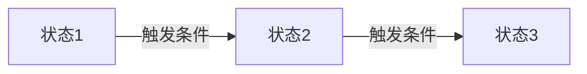
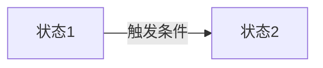
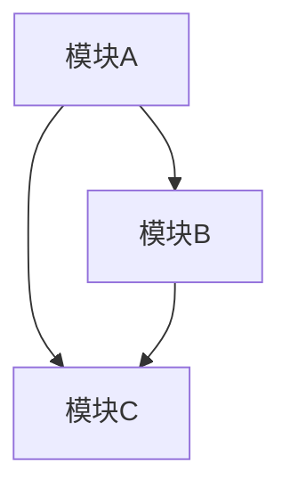

# [产品名称] 需求逻辑定义

## 文档信息

| 字段 | 内容 |
|---|---|
| 产品名称 | [产品名称] |
| 文档版本 | v1.0 |
| 创建日期 | [YYYY-MM-DD] |
| 状态 | 已确认 |

---

## 1. MVP 需求范围

### 1.1 纳入MVP的功能

| 编号 | 功能点 | 优先级 | 纳入理由 |
|---|---|---|---|
| F01 | [功能名称] | P0 | [为什么MVP需要这个] |
| F02 | [功能名称] | P0 | [为什么MVP需要这个] |
| F03 | [功能名称] | P1 | [为什么MVP需要这个] |

### 1.2 暂不纳入MVP的功能

| 编号 | 功能点 | 暂缓原因 |
|---|---|---|
| F10 | [功能名称] | [为什么MVP阶段不需要] |
| F11 | [功能名称] | [为什么MVP阶段不需要] |

### 1.3 范围边界

- **范围内**：[明确什么在MVP范围内]
- **范围外**：[明确什么不在MVP范围内]

---

## 2. 模块需求逻辑

### 2.1 [模块A名称]

#### 模块目标

[一句话说明这个模块要解决什么问题]

#### 核心功能点

| 编号 | 功能点 | 优先级 | 说明 |
|---|---|---|---|
| M01-F01 | [功能名称] | P0 | [功能说明] |
| M01-F02 | [功能名称] | P0 | [功能说明] |

#### 交互逻辑

```
用户操作流程：
1. [步骤1]
2. [步骤2]
3. [步骤3]
```

#### 后端逻辑

**数据流转**：



**业务规则**：

| 规则编号 | 规则描述 | 适用条件 |
|---|---|---|
| R01 | [规则内容] | [什么情况下适用] |

#### 边界条件与异常处理

| 场景 | 处理方式 |
|---|---|
| [异常场景1] | [如何处理] |
| [异常场景2] | [如何处理] |

---

### 2.2 [模块B名称]

#### 模块目标

[一句话说明这个模块要解决什么问题]

#### 核心功能点

| 编号 | 功能点 | 优先级 | 说明 |
|---|---|---|---|
| M02-F01 | [功能名称] | P0 | [功能说明] |

#### 交互逻辑

```
用户操作流程：
1. [步骤1]
2. [步骤2]
```

#### 后端逻辑

**数据流转**：



**业务规则**：

| 规则编号 | 规则描述 | 适用条件 |
|---|---|---|
| R01 | [规则内容] | [什么情况下适用] |

#### 边界条件与异常处理

| 场景 | 处理方式 |
|---|---|
| [异常场景1] | [如何处理] |

---

## 3. 模块间依赖关系



| 依赖关系 | 说明 |
|---|---|
| 模块A → 模块B | [依赖说明] |
| 模块A → 模块C | [依赖说明] |
