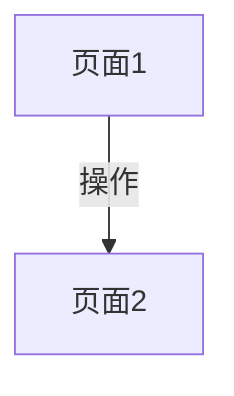

# [产品名称] 界面与交互设计

## 文档信息

| 字段 | 内容 |
|---|---|
| 产品名称 | [产品名称] |
| 文档版本 | v1.0 |
| 创建日期 | [YYYY-MM-DD] |
| 状态 | 已确认 |

---

## 1. 页面结构与导航流程

> 本章节内容来自已确认的「页面结构与导航流程.md」

### 1.1 页面清单

| 页面编号 | 页面名称 | 页面类型 | 所属模块 | 核心职责 |
|---|---|---|---|---|
| P01 | [页面名称] | [类型] | [模块] | [职责] |

### 1.2 导航流程图



---

## 2. 页面交互设计

### 2.1 P01 [页面名称]

#### 页面布局

```
┌─────────────────────────┐
│       [顶部导航栏]        │
├─────────────────────────┤
│                         │
│       [内容区域]          │
│                         │
├─────────────────────────┤
│       [底部操作栏]        │
└─────────────────────────┘
```

#### 核心交互元素

| 元素编号 | 元素名称 | 类型 | 操作 | 反馈 |
|---|---|---|---|---|
| P01-E01 | [元素名] | [按钮/输入框/列表] | [点击/滑动] | [操作后的反馈] |
| P01-E02 | [元素名] | [类型] | [操作] | [反馈] |

#### 状态变化

| 状态 | 触发条件 | 界面变化 |
|---|---|---|
| [状态名] | [什么情况下进入] | [界面如何变化] |
| [状态名] | [什么情况下进入] | [界面如何变化] |

#### 异常场景交互

| 异常场景 | 交互处理 |
|---|---|
| [场景描述] | [提示方式+处理逻辑] |
| [场景描述] | [提示方式+处理逻辑] |

---

### 2.2 P02 [页面名称]

#### 页面布局

```
┌─────────────────────────┐
│       [顶部导航栏]        │
├─────────────────────────┤
│                         │
│       [内容区域]          │
│                         │
└─────────────────────────┘
```

#### 核心交互元素

| 元素编号 | 元素名称 | 类型 | 操作 | 反馈 |
|---|---|---|---|---|
| P02-E01 | [元素名] | [类型] | [操作] | [反馈] |

#### 状态变化

| 状态 | 触发条件 | 界面变化 |
|---|---|---|
| [状态名] | [触发条件] | [界面变化] |

#### 异常场景交互

| 异常场景 | 交互处理 |
|---|---|
| [场景描述] | [处理方式] |

---

## 3. 全局交互规范

### 3.1 统一交互模式

| 交互类型 | 统一规范 |
|---|---|
| 加载状态 | [统一的加载提示方式] |
| 空状态 | [统一的无数据提示方式] |
| 错误提示 | [统一的错误提示方式] |
| 成功反馈 | [统一的操作成功反馈] |
| 返回操作 | [统一的返回交互] |

### 3.2 平台适配说明

| 平台 | 适配要点 |
|---|---|
| [平台名，如iOS] | [适配说明] |
| [平台名，如Android] | [适配说明] |
