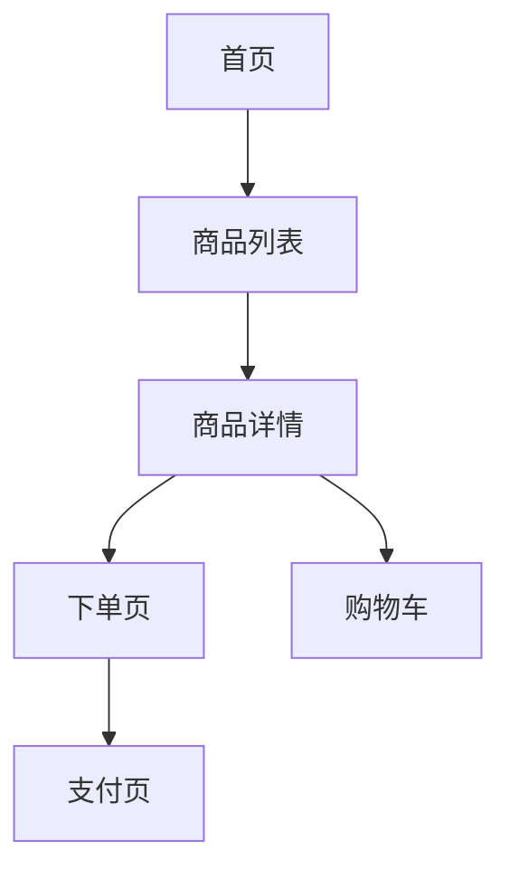

# 界面与交互设计详细指南

## 目录

- [概述](#概述)
- [Step 2.1 页面结构与导航流程的操作指南](#step-21-页面结构与导航流程的操作指南)
- [Step 2.2 整体界面+交互设计的操作指南](#step-22-整体界面交互设计的操作指南)
- [Mermaid图表使用规范](#mermaid图表使用规范)
- [交互设计描述规范](#交互设计描述规范)
- [常见问题与处理策略](#常见问题与处理策略)

---

## 概述

本指南为 Step 2「确定界面+交互设计」提供详细的操作指导。在需求逻辑明确的基础上，将各模块串联为完整的产品界面与交互体系。

**核心原则**：先搭骨架（页面结构与导航），再填血肉（界面与交互细节）。

---

## Step 2.1 页面结构与导航流程的操作指南

### 页面梳理方法

从已确认的需求逻辑定义中提取页面清单：

1. 遍历每个模块的交互逻辑，提取涉及的用户界面
2. 识别页面类型：主页面、弹窗/浮层、详情页、表单页等
3. 标注每个页面的核心职责

### 页面清单输出格式

```markdown
## 页面清单

| 页面编号 | 页面名称 | 页面类型 | 所属模块 | 核心职责 |
|---|---|---|---|---|
| P01 | [名称] | [类型] | [模块] | [职责] |
```

### 导航流程图绘制

使用 Mermaid flowchart 语法绘制导航流程：



### 导航流程图绘制规范

- 使用 `flowchart TD`（自上而下）或 `flowchart LR`（从左到右）
- 节点使用页面编号+名称标注
- 用实线箭头表示主要导航路径
- 用虚线箭头表示次要/返回路径（如需要）
- 标注关键入口点（如：Tab栏入口、推送入口）
- 标注关键出口点（如：完成流程后的去向）

### 页面说明规范

对每个页面提供简要说明：

```markdown
### P01 [页面名称]

- **入口**：[从哪里进入这个页面]
- **核心内容**：[页面展示什么]
- **主要操作**：[用户可以做什么]
- **出口**：[可以跳转到哪里]
```

---

## Step 2.2 整体界面+交互设计的操作指南

### 讨论引导策略

1. **先听用户说**：让用户先描述最关心的界面和交互逻辑
2. **抓大放小**：聚焦核心流程的交互，细节后续可迭代
3. **串联验证**：将各模块的交互逻辑串联起来验证整体流畅性
4. **补充完善**：基于已确认的导航流程，补充用户未提及的交互细节

### 页面布局描述规范

对每个关键页面，按以下结构描述：

```markdown
### [页面名称] 界面设计

#### 页面布局
[描述页面的整体布局结构，如：顶部导航栏 + 内容区 + 底部操作栏]

#### 核心交互元素
| 元素 | 类型 | 操作 | 反馈 |
|---|---|---|---|
| [元素名] | [按钮/输入框/列表等] | [点击/滑动等] | [操作后的反馈] |

#### 状态变化
| 状态 | 触发条件 | 界面变化 |
|---|---|---|
| [状态名] | [什么情况下进入] | [界面如何变化] |

#### 异常场景交互
| 异常场景 | 交互处理 |
|---|---|
| [场景] | [如何提示和处理] |
```

### 交互设计原则

1. **一致性**：相同操作在不同页面的交互方式保持一致
2. **可预期**：操作结果符合用户预期，不出现意外跳转
3. **可恢复**：关键操作提供撤销或返回机制
4. **反馈及时**：用户操作后有明确的视觉或文字反馈
5. **容错性**：输入错误时给出明确提示和修正引导

### 整体串联验证

完成各页面交互设计后，进行整体串联验证：

1. 选择2-3个核心用户场景
2. 从用户进入产品开始，走完整个操作路径
3. 检查每个步骤的交互是否连贯
4. 检查页面间的数据传递是否合理
5. 检查异常场景是否有合理的出口

---

## Mermaid图表使用规范

### 支持的图表类型

| 图表类型 | 语法 | 适用场景 |
|---|---|---|
| 流程图 | `flowchart` | 导航流程、操作流程 |
| 状态图 | `stateDiagram-v2` | 状态流转 |
| 序列图 | `sequenceDiagram` | 交互时序 |

### 流程图规范

```
flowchart TD
    A[页面A] -->|操作说明| B[页面B]
    B -->|条件| C[页面C]
    B -->|其他条件| D[页面D]
```

### 状态图规范

```
stateDiagram-v2
    [*] --> 待支付
    待支付 --> 已支付: 完成支付
    已支付 --> 待发货: 系统确认
    待发货 --> 已发货: 商家发货
    已发货 --> 已完成: 用户确认收货
```

---

## 交互设计描述规范

### 操作描述格式

使用"当...时，用户可以...，系统将..."的格式描述交互：

- **触发条件**：什么情况下可以操作
- **用户操作**：用户执行什么动作
- **系统响应**：系统如何反馈
- **结果状态**：操作后的状态变化

### 动效与过渡说明

仅在以下情况需要描述动效：
- 影响用户理解流程的过渡动画
- 需要特别强调的反馈动效
- 与交互逻辑直接相关的动画（如滑动删除）

其他动效细节不在PRD层面描述。

---

## 常见问题与处理策略

| 问题 | 处理策略 |
|---|---|
| 页面数量过多 | 按模块分组，优先讨论核心流程涉及的页面 |
| 导航层级过深 | 建议扁平化，提出替代方案 |
| 交互方式与平台规范不符 | 提醒用户平台设计规范，建议调整 |
| 模块间交互逻辑断裂 | 明确指出断裂点，提供衔接方案 |
| 用户关注细节忽略全局 | 引导用户先确认全局流程，再深入细节 |
| 缺少异常场景的交互设计 | 主动列举典型异常场景，引导用户补充 |
